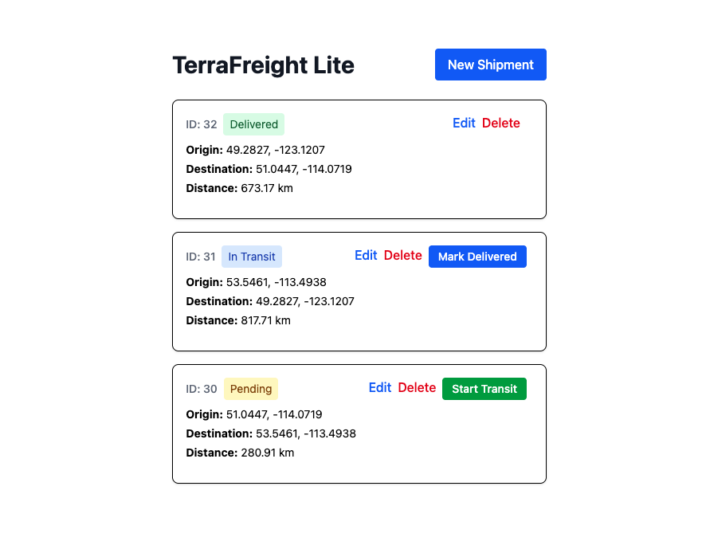
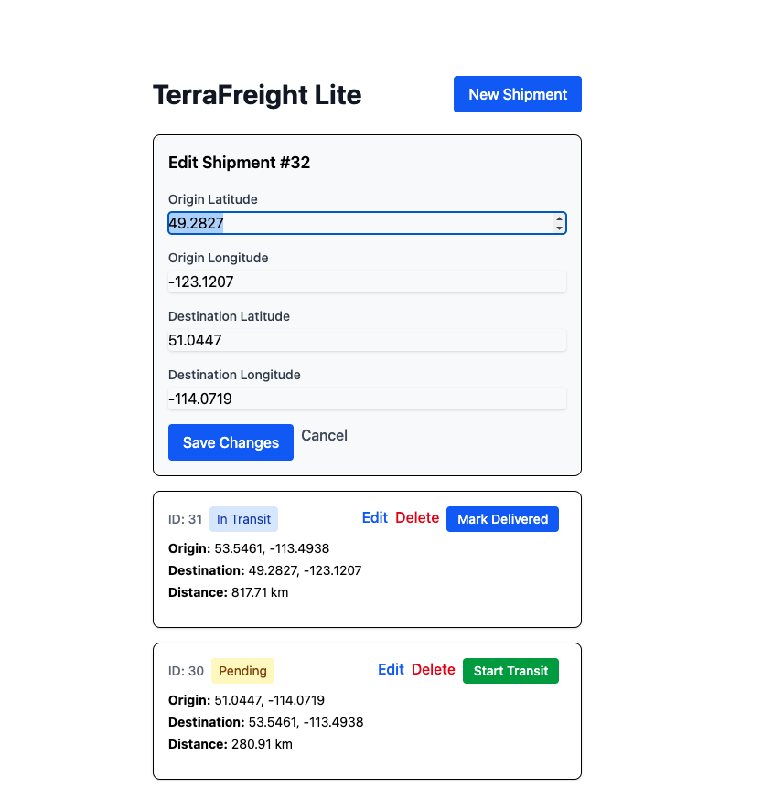

# TerraFreight Lite

A lightweight shipment tracking application demonstrating Domain-Driven Design principles with real-time updates using Rails 8 and Hotwire.

## Purpose

TerraFreight Lite solves a core problem in freight logistics: **providing real-time visibility into shipment status for both shippers and carriers**. Instead of constant phone calls and emails asking "where's my shipment?", all stakeholders can see live updates as shipments progress through their lifecycle (on a small scale).

## Key Features

### Domain-Driven Design
- **Aggregate Root**: `Shipment` model encapsulates all business logic and enforces invariants
- **Domain Methods**: Status transitions happen through explicit methods (`mark_in_transit!`, `mark_delivered!`) rather than direct attribute updates
- **Business Logic in Model**: Distance calculations and validation rules live in the domain model, not scattered across controllers
- **Protected Invariants**: Status cannot be changed through form submissions—only through domain methods that enforce business rules

### Real-Time Updates with Hotwire
- **Turbo Frames**: Inline editing without page navigation—click "Edit" and the form appears in place
- **Turbo Streams**: Real-time status updates broadcast to all connected users—when one user clicks "Start Transit", everyone sees the update instantly

### Geographic Calculations
- Stores origin and destination coordinates with 4 decimal precision (~11 meter accuracy)
- Calculates straight-line distance using the Haversine formula via Geocoder gem
- Validates coordinate ranges (lat: -90 to 90, lng: -180 to 180)

## Tech Stack

- **Ruby 3.4.5**
- **Rails 8.0.4**
- **PostgreSQL 17** (with PostGIS extension ready)
- **Hotwire** (Turbo Frames + Turbo Streams)
- **TailwindCSS** for styling
- **Geocoder** for distance calculations
- **Redis** for real-time broadcasting
- **Minitest** for testing

## Setup Instructions

1. **Clone and install dependencies:**
```bash
git clone <your-repo-url>
cd terrafreight-lite
bundle install
```

2. **Setup database:**
```bash
rails db:create
rails db:migrate
rails db:seed
```

3. **Start the server:**
```bash
rails server
```

4. **Visit:** http://localhost:3000

## Testing

Run the test suite:
```bash
bundle exec rails test
```

Current test coverage:
- Model validations and business logic (11 tests)
- Controller CRUD operations (8 tests)

## Design Decisions

### Why Domain Methods Over Direct Updates?
Instead of `shipment.update(status: :in_transit)`, we use `shipment.mark_in_transit!` because:
- Encapsulates business rules (e.g., can't transition from delivered back to pending)
- Provides a clear audit trail of operations
- Makes it easy to add side effects (notifications, logging) in one place
- Documents the business operations in code

### Why Separate Turbo Frames and Turbo Streams?
- **Turbo Frames**: For personal interactions (editing a shipment affects only your view)
- **Turbo Streams**: For shared state changes (status updates everyone needs to see)
This separation keeps concerns clear and performance optimal.

### Why Not Store Distance?
Distance is derived data—it's calculated from lat/lng coordinates. Storing it would be redundant and could get out of sync if coordinates change. We calculate on-the-fly, which is fast enough for this use case.

## What I'd Build Next

### Short Term (Next Sprint)
1. **User Authentication**: Add shipper and carrier roles with different permissions
2. **Status Transition Validation**: Prevent invalid transitions (e.g., delivered → pending)
3. **Timestamps**: Track when each status transition occurred
4. **Cancelled Status**: Handle exception cases where shipments are cancelled
5. **Integration Tests**: Add system tests for the full Turbo Frame/Stream flows


## Project Structure
```
app/
├── models/
│   └── shipment.rb           # Aggregate root with domain logic
├── controllers/
│   └── shipments_controller.rb  # Thin controller, delegates to model
├── views/
│   └── shipments/
│       ├── index.html.erb    # Main list with Turbo Stream subscription
│       ├── _shipment.html.erb # Turbo Frame for inline editing
│       ├── edit.html.erb     # Edit form (loads in frame)
│       └── *.turbo_stream.erb # Real-time update templates
└── helpers/
    └── shipments_helper.rb   # View helpers (status badge colors)
```
## Screenshots

### Shipment List with Real-Time Status Updates


### Inline Editing with Turbo Frames

